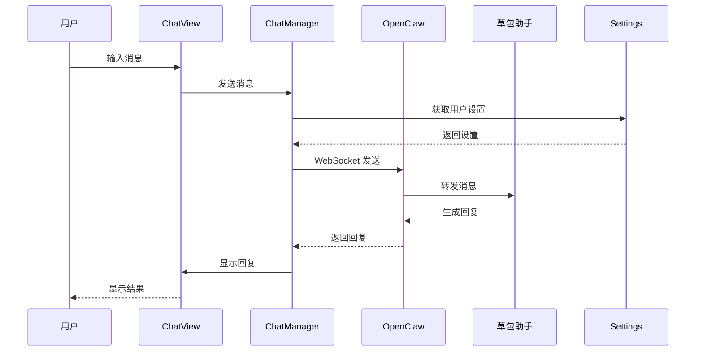
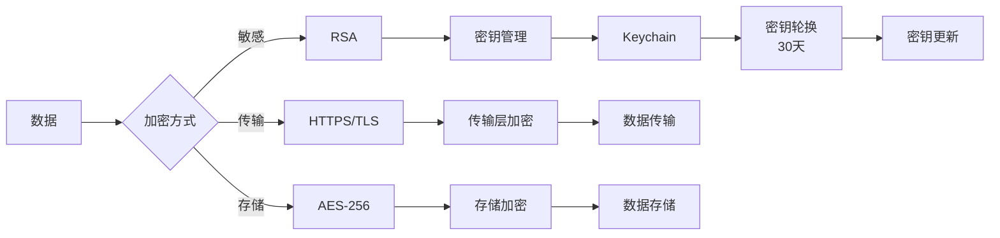
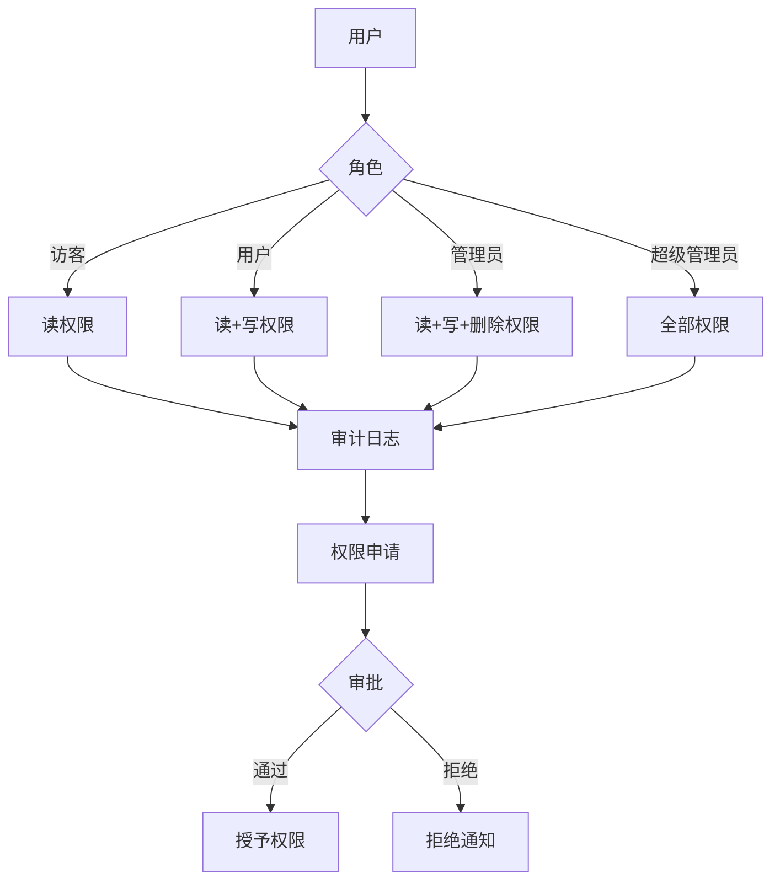
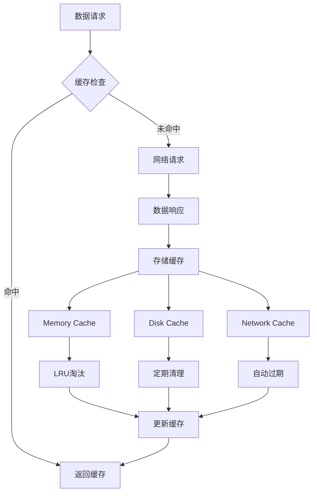
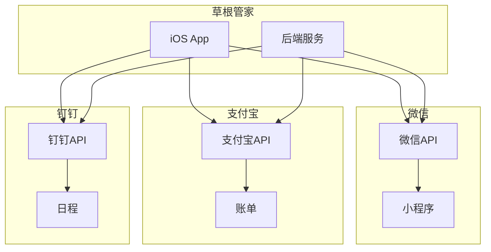
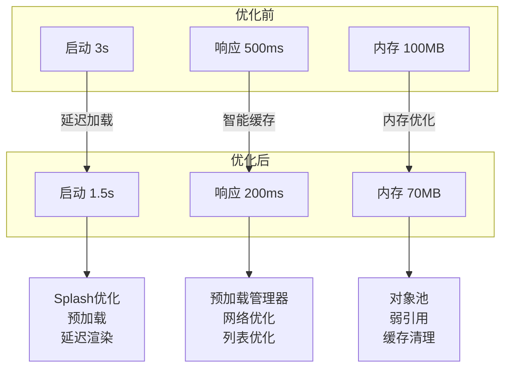
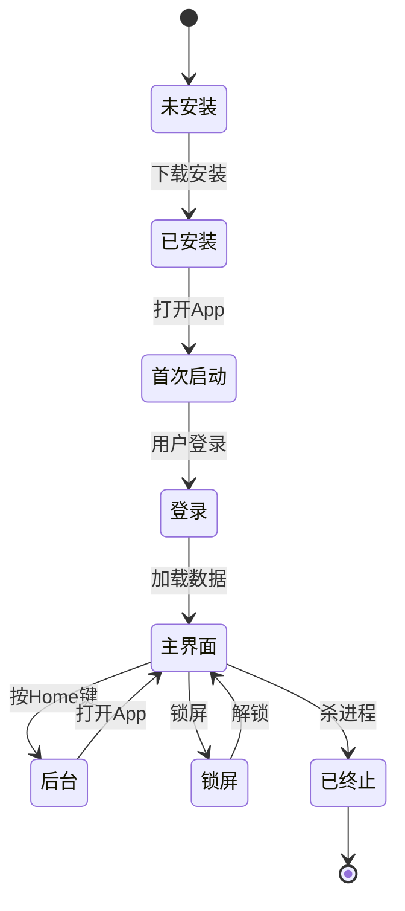
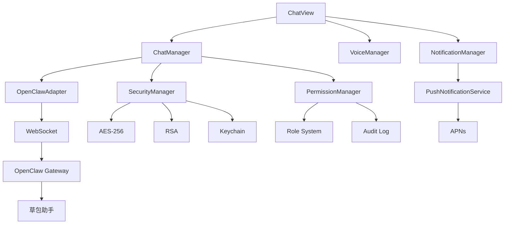
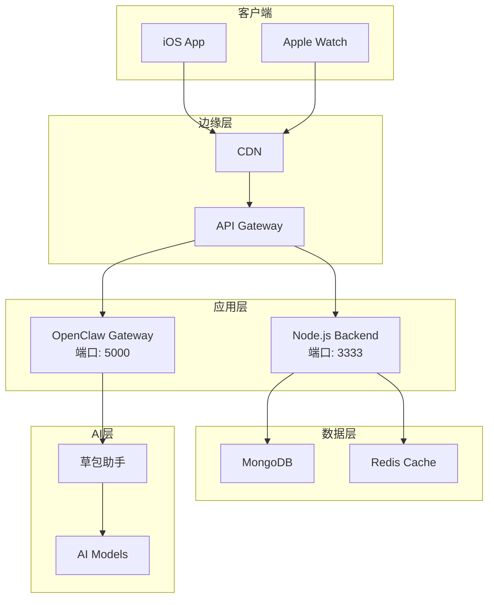

# 草根管家 - 架构图

## 系统架构图

```mermaid
graph TB
    subgraph 用户层
        iOS[iOS App<br/>SwiftUI]
        Watch[Apple Watch<br/>WatchKit]
        Siri[Siri Shortcuts<br/>Intents]
    end

    subgraph 展示层
        ChatView[聊天界面]
        VoiceView[语音界面]
        WeatherView[天气界面]
        HealthView[健康界面]
        ExpenseView[记账界面]
        HabitView[习惯界面]
    end

    subgraph 业务层
        ChatManager[聊天管理器]
        VoiceManager[语音管理器]
        WeatherManager[天气管理器]
        HealthManager[健康管理器]
        ExpenseManager[记账管理器]
        HabitManager[习惯管理器]
    end

    subgraph 服务层
        AIDialogueEngine[AI对话引擎]
        PredictionEngine[预测引擎]
        RecommendationEngine[推荐引擎]
        WeChatManager[微信集成]
        AlipayManager[支付宝集成]
        DingTalkManager[钉钉集成]
        SecurityManager[安全管理器]
        PermissionManager[权限管理器]
        SiriShortcutsManager[Siri快捷指令]
        WidgetManager[Widget小组件]
        AppleWatchManager[Apple Watch管理]
    end

    subgraph 数据层
        UserDefaults[用户设置]
        Keychain[敏感信息]
        CoreData[本地数据库]
        FileStorage[文件存储]
        CloudStorage[云端存储]
        MemoryCache[内存缓存]
        DiskCache[磁盘缓存]
    end

    subgraph 网络层
        OpenClaw[OpenClaw Gateway<br/>ws://127.0.0.1:5000]
        Caobao[草包助手]
        WeatherAPI[天气API]
        TranslationAPI[翻译API]
        OCRAPI[OCR API]
        Backend[后端服务<br/>Node.js + Express<br/>端口: 3333]
        MongoDB[MongoDB]
    end

    iOS --> ChatView
    iOS --> VoiceView
    iOS --> WeatherView
    iOS --> HealthView
    iOS --> ExpenseView
    iOS --> HabitView

    Watch --> AppleWatchManager
    Siri --> SiriShortcutsManager

    ChatView --> ChatManager
    VoiceView --> VoiceManager
    WeatherView --> WeatherManager
    HealthView --> HealthManager
    ExpenseView --> ExpenseManager
    HabitView --> HabitManager

    ChatManager --> AIDialogueEngine
    WeatherManager --> WeatherAPI
    HealthManager --> RecommendationEngine
    ExpenseManager --> PredictionEngine
    HabitManager --> IntelligentAnalytics

    ChatManager --> WeChatManager
    ExpenseManager --> AlipayManager
    HabitManager --> DingTalkManager

    ChatManager --> SecurityManager
    ChatManager --> PermissionManager
    iOS --> SiriShortcutsManager
    iOS --> WidgetManager

    AIDialogueEngine --> OpenClaw
    OpenClaw --> Caobao
    ChatManager --> Backend
    Backend --> MongoDB
    ChatManager --> CoreData
    ChatManager --> Keychain
    ChatManager --> CloudStorage
    ChatManager --> MemoryCache
    ChatManager --> DiskCache
```

---

## 数据流图

### AI对话流程

---

## 安全架构图

---

## 权限架构图

---

## 缓存架构图

---

## 第三方集成架构

---

## 性能优化架构

---

## App生命周期

---

## 模块依赖关系

---

## 系统部署架构

---

**主人，这就是草根管家的完整架构图！** 🏗️✨
